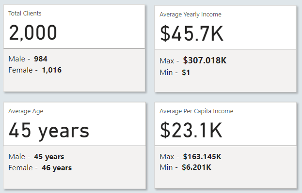

# Aurora-Bank-Transaction-Data-Insights
---
## Company Overview
Aurora Bank is a forward-thinking financial institution providing comprehensive credit card services to customers across North America, Europe, Asia-Pacific, and Africa. Partnering with major card networks, including Mastercard, Visa, Discover, and American Express, the bank delivers seamless payment solutions to a diverse global customer base.

With a strong emphasis on leveraging data analytics, Aurora Bank strives to enhance operational efficiency, deepen customer engagement, and strengthen risk management strategies. By adopting innovative technologies and insights-driven approaches, the bank is committed to delivering exceptional financial services while fostering growth and ensuring security in an ever-evolving financial landscape.
## Brief
The management team requires data analytics insights to gain a comprehensive understanding of customer profiles, enabling them to tailor services effectively. They need to have a clearer view of spending trends across their card network partners, including **Mastercard**, **Visa**, **Discover**, and **American Express**. Additionally, it is crucial to identify potential credit risks and monitor transaction errors to ensure smooth operations and minimize financial exposure. These insights empower stakeholders to make informed, data-driven decisions that drive strategic growth, improve customer satisfaction, and enhance risk management practices.
## Objectives
The objectives of this data analytics project is to develop an interactive dashboard that provides stakeholders of the bank with valuable insights into customer profiles, spending trends, credit risks, and transaction errors. This dashboard will empower the stakeholders to make data-driven decisions, enhance customer engagement, and optimize risk management strategies effectively.
## Key Questions
1. What is the demographic composition of our customers in terms of gender, age group, income level, credit score, and debt levels?
2. Which transaction categories do our customers spend the most on?
3. Which regions account for the highest customer spending?
4. How do transaction volumes vary across our card network partners **(Mastercard, Visa, Discover, and American Express)**?
5. Which card network experiences the highest rate of failed transactions?
6. What are the primary reasons behind transaction errors?
## Data Collection
A **raw CSV files** with over **150,000** records spanning the period from **2022 to 2024** was provided. The dataset included key attributes such as **dim_cards_data**, **dim_users_data**, **calendar**, **dim_mcc_codes**, and **fact_transactions_data**. The data was extracted from the folder and imported into **Power Query**, where it underwent thorough cleaning and transformation.
## Data Cleaning & Preparation in Power Query
### Steps taken:
1. **Duplicate Removal:** some of the data contained duplicates which were eliminated
2. **Replacing value:** replaced some data fields due to spelling errors to ensure data integrity
3. **Change Data type:** applied the right data types for each of the columns in the table
4. **Custom columns:** created custom columns for more detailed analysis
45. ### Outcome:
Cleaned and structured data, ready for analysis and visualization

## Data Modeling
Established relationship between key tables: **dimension tables** and the **facts tables** as seen below:


The data model is a **star schema**. There are **4 dimension tables** and **1 fact table**. The dimension tables are all joined to the fact tables on a **one-to-many relationship**.

## DAX measures
Some of the DAX measures that were created are:
```dax
Number of  Transactions = DISTINCTCOUNT(fact_transactions_data[id])

Debt-to-income ratio = [total debt]/[total yearly income] * 100

Mastercard Transaction Amount = CALCULATE([Total Transaction Amount], dim_cards_data[card_brand] = "Mastercard")
```
## Visualization and Analysis
The analysis was divided into **4 dashboard pages**, with each pages targeting specific insights. You can interact with the report [here](https://app.powerbi.com/groups/me/reports/f71368f4-bd06-44a3-9d9b-0613ef1e9770/ReportSection?experience=power-bi)

### Page 1: Demographics Dashboard


### Key Visuals:
**1. Key Performance Indicators Tiles:**



**Insights:** 
- Aurora Bank currently serves **2,000** customers, comprising **1,016** females and **984** males.
- The average annual income of customers is **$45,000**.
- The average age of male customers is **45 years**, while female customers have an average age of **46 years**.
- The average per capita income across all customers is **$23,000**, with a maximum of **$163,000** and a minimum of **$6,200**.

**Recommendation:** 
- Leverage gender and age demographics to design tailored campaigns that resonate with male and female customers in their respective age groups.
- Utilize the average annual income and spending patterns to identify upselling and cross-selling opportunities for products like credit cards or savings plans.

**2. Customers Age Group Distribution:**


**Insights:** 
- Among customers aged **18 to 20 years**, males recorded the highest count at **99**, compared to **92** females.
- In the **21 to 30 age group**, females led with **185** customers, slightly surpassing males at **182**.
- For the **31 to 40 age range**, females also outnumbered males, with **180** customers compared to **166**.
- In the **41 to 50 age group**, males were the majority at **191**, slightly higher than females at **189**.
- Among customers aged **51 to 60 years**, males accounted for **168**, exceeding females at **156**.
- For the **61 to 70 age group**, females were ahead with **105** customers, compared to **94** males.
- In the **70+ age category**, females recorded the highest count at **109**, compared to **84** males.

**Recommendation:**
- Develop targeted campaigns for different age groups, focusing on products and services that cater to the preferences and financial needs of each demographic.
- Since males dominate the **18–20 age group**, offer tailored financial education and entry-level credit products to attract and retain these younger customers.
- With females leading in most age categories, particularly in the **21–30, 31–40, 61–70, and 70+ age groups**, design personalized offerings such as family-oriented credit plans

**3. Income Group Distribution and Credit Score:**


**Insights:** 
- **70.25%** of the bank's customers are classified as low-income earners, with annual earnings below **$50,000**. Middle-income earners, earning between **$50,000 and $100,000**, make up **27.15%** of the customer base. Meanwhile, high-income earners, with annual incomes exceeding **$100,000**, account for just **2.6%** of customers.
- Among the bank's customers, **26.7%** have an **Excellent credit score** of **750** or higher. Those with a **Good credit score (700-749)** represent **32%** of the customer base. Customers in the **Fair category**, with credit scores ranging from **650 to 699**, make up **24.6%**, while **16.7%** fall into the **Poor category** with credit scores below **650**.

**Recommendation:**
- Since **70.25%** of customers are low-income earners, the bank should focus on developing affordable financial products and services, such as low-interest credit cards or micro-loans, to better cater to their needs.
- With **29.75%** of customers in the middle- and high-income brackets, the bank can explore premium services, such as rewards programs, investment products, or exclusive credit cards, to maximize revenue from these segments.
- Given that **41.3%** of customers fall into the Fair or Poor credit score categories, the bank should consider introducing financial literacy campaigns, credit-building tools, and personalized credit improvement plans to help customers enhance their scores and reduce credit risk.
- With **58.7%** of customers having Good or Excellent credit scores, the bank can incentivize this group with tailored offers, such as higher credit limits, cashback rewards, or attractive interest rates, to drive engagement and retention.

### Page 2: Financial Health Dashboard


### Key Visuals:
**1. Customers Debt across Age Group:**


**Insights:** 
- Among customers aged **18 to 20 years**, **males** recorded the highest total debt at **$7.4 million**, slightly exceeding **females** at **$7.1 million**.
- In the **21 to 30 age group**, **females** carried the highest debt, totaling **$14.4 million**, compared to **$13.1 million for males**.
- For customers aged **31 to 40 years**, **females** also had a higher debt burden at **$13.1 million**, while **males** recorded **$12 million**.
- Within the **41 to 50 age group**, **males** held the highest debt at **$12.8 million**, compared to **$12.4 million** for females.
- In the **51 to 60 age range**, **males** again had the highest debt at **$12.8 million**, surpassing **females** at **$11.4 million**.
- Among customers aged **61 to 70 years**, **females** carried a higher debt total of **$5.2 million**, compared to **$4.1 million for males**.
- For customers **over 70 years old**, **males** recorded the highest debt at **$0.9 million**, slightly exceeding **females at $0.7 million**.

**Recommendation:**
- Develop age-specific financial literacy and debt management programs to help customers, particularly younger age groups **(18–30 years)**, manage their debt levels more effectively.
- Address the higher debt burden among females in the **21–40 and 61–70 age groups** through personalized financial advisory services or tailored repayment plans.
- Focus on providing refinancing or consolidation options for **males aged 41–60 years**, as they consistently have the highest debt burden in their respective age groups.
- Offer tailored support for customers **over 70 years** to ensure their debt levels remain manageable and do not affect their financial stability in retirement.

**2. Customers Debt across Income Group and Credit Score:**


**Insights:** 
- Customers in the **low-income category (55.06%)** held the largest share of total debt, followed by **middle-income customers (38.2%)**, while **high-income customers** accounted for the smallest proportion of debt at **6.7%**.
- Customers with a **"Good" credit score** made up the highest share of debt at **31.24%**. Those with **"Excellent" and "Fair" credit scores** contributed equally, each accounting for **24.4% of the debt**. Meanwhile, customers with a **"Poor" credit score** held the lowest share at **19.95%.**
  
**Recommendation:**
- Focus on providing  debt restructuring options tailored to low-income customers, as they hold the largest share of debt. This will help mitigate default risks and improve repayment rates.
- Develop strategies to support middle-income customers, such as offering flexible repayment plans or incentives for early repayments, as they represent a significant portion of debt.
- For customers with **"Good" and "Fair" credit scores**, consider offering personalized financial solutions to maintain their loyalty while reducing the likelihood of increased debt accumulation.
  
### Page 3: Transactions Dashboard


### Key Visuals:
**1. Transaction Spending Patterns:**


**Insights:** 
- The majority of **transaction spending** was directed toward the **Automotive category**, followed by **Miscellaneous** as the second-highest spending category. **Retail** accounted for the next highest spending, followed by **Healthcare and Entertainment**. **Floristry** recorded the lowest level of spending among all categories.

**Recommendation:** 
- Since the majority of spending is directed toward **Automotive**, consider exploring partnerships or targeted offers with automotive brands or services to better engage this customer segment.
- The second-highest spending in **Miscellaneous** indicates potential for diverse customer needs. Consider launching tailored promotions or bundling services in this category to maximize revenue.
- Given the significant portion of spending in **Retail and Healthcare**, develop customer loyalty programs or cross-promotions with retail and healthcare providers to enhance customer retention and increase sales.
- With a moderate share of spending in **Entertainment**, explore more personalized offerings or experiences in this category to boost customer spending.

**2. Transaction Spending Pattern across Region:**


**Insights:** 
- The **top five states** with the highest transaction amounts are **California, followed by Texas, New York, Florida, and North Carolina, with California** leading in total transaction volume.
- The **top five cities** with the highest transaction amounts are **Houston, Atlanta, Orlando, Yorba Linda, and Richmond, with Houston** recording the highest transaction volume.

**Recommendation:** 
- Given that **California, Texas, and New York** are the top three states with the highest transaction amounts, consider focusing targeted marketing campaigns in these regions to maximize customer engagement and promote products or services that align with local spending patterns.
- Since **Houston** leads the cities with the highest transaction amounts, it may be beneficial to explore further opportunities for growth or partnerships in **Texas**, specifically in Houston, to leverage its higher spending capacity.
- Tailor offerings or promotions in **Florida and North Carolina** based on regional preferences and spending behaviors, as they also contribute significantly to overall transaction volumes.
- With cities like **Houston, Atlanta, and Orlando** among the top for transaction volumes, explore partnerships, regional initiatives, or localized discounts to deepen customer relationships in these high-performing cities.
  

### Page 4: Card Details Dashboard


### Key Visuals:
**1. Card Partners Details:**


**Insights:** 
- **Mastercard** led in transaction volume, recording a total of **$3.83 million**, with **3,209** cards issued and **82,000** transactions processed.
- **Visa Card** followed as the second-highest transaction volume, with a total of **$2.72 million**, **2,326** cards issued, and **60,541** transactions processed.
- **American Express** ranked third, with a total transaction amount of **$591.43k**, **402** cards issued, and **11,287** transactions processed.
- **Discover Cards** recorded the lowest transaction amount at **$181.76k**, with **209** cards issued and **3,396** transactions processed.

**Recommendation:** 
- Given **Mastercard** dominance in both transaction amount and volume, Mastercard should be prioritized for targeted marketing and customer engagement initiatives. Explore potential partnerships or offers that could further drive adoption and usage.
- With **Visa** trailing closely behind Mastercard, explore opportunities to boost Visa card usage, such as exclusive promotions or increasing cardholder benefits to close the gap.
- Though ranked third, **American Express** shows potential for growth. Target specific customer segments with tailored campaigns to increase card issuance and usage.
- As the lowest in transaction volume, assess the reasons behind **Discover's** underperformance. Consider revising marketing strategies, partnerships, or offering incentives to boost cardholder engagement and transaction volume.

**2. Transaction Errors:**


**Insights:** 
- **Insufficient balance**, which accounted for the highest number of errors.
- **Incorrect or bad PIN**, coming in second.
- **Technical glitches**, which caused the third-highest number of errors.
- **Invalid card number**, contributing to the next level of transaction issues.
- **Expired cards**, which ranked fifth in terms of error frequency.

**Recommendation:** 
- Provide clear guidance to customers on maintaining sufficient balance, updating their PINs regularly, and ensuring their card details are accurate and up to date.
- Consider implementing additional security measures to prevent PIN-related errors, such as offering a PIN recovery or reset option, or exploring biometric authentication for a more seamless transaction experience.
- Work with the IT department to enhance system stability and minimize the occurrence of technical glitches. Regular software updates and robust system testing should be a priority.
- Introduce more frequent reminders to customers to check their card expiration dates and provide an easier way for them to replace or renew expired cards.

**3. Card Brands with Failed Transactions and Credit Limit:**


**Insights:** 
- **Mastercard** recorded the highest transaction failure rate at **46.44%**, followed by **Visa** at **40.46%**, **American Express** at **10.73%**, and **Discover** at **2.32%**
- **Mastercard** also offered the highest **credit limit**, totaling **$47 million**, followed by **Visa** with **$34 million**, **American Express** with **$5 million**, and **Discover** with **$2 million**.

**Recommendation:** 
- The high failure rate for **Mastercard (46.44%)** should be a priority for improvement. Investigate the causes of these failures, whether they are due to insufficient balances, incorrect PIN entries, or technical glitches, and work on optimizing systems to reduce this rate, potentially enhancing customer experience.
- While **Mastercard** has the highest credit limit, it is also experiencing the highest failure rate. Reevaluate the credit policies to ensure that higher credit limits are supported by stronger risk management strategies, to reduce transaction failures without compromising on customer access to credit.
- Given that **Visa and American Express** have relatively lower failure rates but offer significant credit limits, there may be opportunities to attract more customers by enhancing their offerings and targeting new user segments, possibly offering higher credit limits or additional benefits.
- Despite the low transaction failure rate and credit limits, **Discover's** smaller customer base and transaction volume could indicate a potential area for growth. Consider marketing strategies to increase Discover card adoption and overall transaction volumes.

### Tools used:
- Power BI: Extract, Transform, and Load. Also, for performing exploratory analysis, dashboard creation, interactivity, and visual analysis.

### Contact Information
Email: luckyodeh001@gmail.com

Linkedin: [linkedin Profile](https://www.linkedin.com/in/lucky-odeh-nosakhare)


