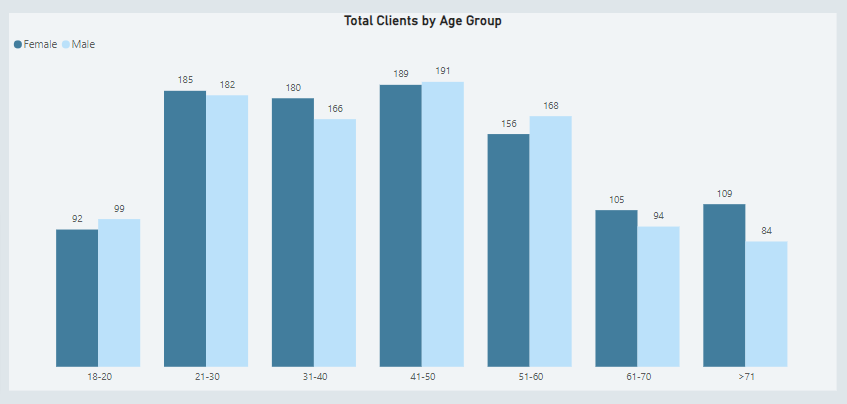

# Aurora-Bank-Data-Insights
---
## Company Overview
Aurora Bank is a forward-thinking financial institution providing comprehensive credit and debit card services to customers across North America, Europe, Asia-Pacific, and Africa. Partnering with major card networks, including Mastercard, Visa, Discover, and American Express, the bank delivers seamless payment solutions to a diverse global customer base.

With a strong emphasis on leveraging data analytics, Aurora Bank strives to enhance operational efficiency, deepen customer engagement, and strengthen risk management strategies. By adopting innovative technologies and insights-driven approaches, the bank is committed to delivering exceptional financial services while fostering growth and ensuring security in an ever-evolving financial landscape.
## Brief
The bank’s stakeholders require data analytics insights to gain a comprehensive understanding of customer profiles, enabling them to tailor services effectively. They need to have a clearer view of spending trends across their card network partners, including Mastercard, Visa, Discover, and American Express. Additionally, it is crucial to identify potential credit risks and monitor transaction errors to ensure smooth operations and minimize financial exposure. These insights empower stakeholders to make informed, data-driven decisions that drive strategic growth, improve customer satisfaction, and enhance risk management practices.
## Objectives
The objectives of this data analytics project is to develop an interactive dashboard that provides stakeholders with valuable insights into customer profiles, spending trends, credit risks, and transaction errors. This dashboard will empower stakeholders to make data-driven decisions, enhance customer engagement, and optimize risk management strategies effectively.
## Key Questions
1. What is the demographic composition of our customers in terms of gender, age group, income level, credit score, and debt levels?
2. Which transaction categories do our customers spend the most on?
3. Which regions account for the highest customer spending?
4. How do transaction volumes vary across our card network partners (Mastercard, Visa, Discover, and American Express)?
5. Which card network experiences the highest rate of failed transactions?
6. What are the primary reasons behind transaction errors?
## Data Collection
A **raw CSV files** with over **150,000** records spanning the period from **2022 to 2024** was provided. The dataset included key attributes such as **dim_cards_data**, **dim_users_data**, **calendar**, **dim_mcc_codes**, and **fact_transactions_data**. The data was extracted from the folder and imported into **Power Query**, where it underwent thorough cleaning and transformation.
## Data Cleaning & Preparation in Power Query
### Steps taken:
1. **Duplicate Removal:** some of the data contained duplicates which were eliminated
2. **Replacing value:** replaced some data fields due to spelling errors to ensure data integrity
3. **Change Data type:** applied the right data types for each of the columns in the table
4. **Custom columns:** created custom columns for more detailed analysis
45. ### Outcome:
Cleaned and structured data, ready for analysis and visualization

## Data Modeling
Established relationship between key tables: **dimension tables** and the **facts tables** as seen below:


The data model is a **star schema**. There are **4 dimension tables** and **1 fact table**. The dimension tables are all joined to the fact tables on a **one-to-many relationship**.

## DAX measures
Some of the DAX measures that were created are:
```dax
Number of  Transactions = DISTINCTCOUNT(fact_transactions_data[id])

Debt-to-income ratio = [total debt]/[total yearly income] * 100

Mastercard Transaction Amount = CALCULATE([Total Transaction Amount], dim_cards_data[card_brand] = "Mastercard")
```
## Visualization and Analysis
The analysis was divided into **4 dashboard pages**, with each pages targeting specific insights. You can interact with the report [here](https://app.powerbi.com/groups/me/reports/f71368f4-bd06-44a3-9d9b-0613ef1e9770/ReportSection?experience=power-bi)

### Page 1: Demographics Dashboard


### Key Visuals:
**1. Key Performance Indicators Tiles:**


**Insights:** 
- Aurora Bank currently serves 2,000 customers, comprising 1,016 females and 984 males.
- The average annual income of customers is $45,000.
- The average age of male customers is 45 years, while female customers have an average age of 46 years.
- The average per capita income across all customers is $23,000, with a maximum of $163,000 and a minimum of $6,200.

**Recommendation:** 
- Leverage gender and age demographics to design tailored campaigns that resonate with male and female customers in their respective age groups.
- Utilize the average annual income and spending patterns to identify upselling and cross-selling opportunities for products like credit cards or savings plans.

**2. Customers Age Group Distribution:**



**Insights:** 
- For customers within age group 18 to 20 years, the male recorded the highest at 99 compared with the female at 92
- For customers within age group of 21 to 30 years, the female are the highest at 185 when compared with the male at 182.
- For customers within age group 31 to 40 years, the female are the highest at 180 when compared with the male at 166
- For customers within age group of 41 to 50 years, the male are the highest at 191 compared with the female at 189.
- For customers within age group 51 to 60 years the male recorded 168 compared with the female at 156
- For customers within age group 61 to 70 years, the female recorded 105 compared with the male at 94
- For customers within age group greater than 70 years, the female recorded the highest at 109 compared with the male at 84 

**Recommendation:**

**3. Income Group Distribution and Credit Score:**


**Insights:** 
- 70.25% of the bank customers are low income earners, they are those category that earns below $50k, while 27.15% of the customers are middle income earners, earning between $50k to $100k, while 2.6% of the customers are high income customers earning above $100k.
- 26.7% of the bank customers with Excellent score have a credit score of 750 and above, while 32% with Good score have a credit score of 700 and above, while 24.6% with Fair score, have a credit score of 650 and above, while 16.7% of customers with Poor score have a credit score below 650

**Recommendation:**

### Page 2: Financial Health Dashboard


### Key Visuals:
**1. Customers Debt across Age Group:**


**Insights:** 
- The age group within 18 to 20 years, the male recorded the highest debt at $7.4m when compared with the female at $7.1m
- The age group within 21 to  30 years, the female recorded the highest debt at $14.4m when compared with the male at $13.1m
- The age group within 31 to  40 years, the female recorded the highest debt at $13.1m when compared with the male at $12m
- The age group within 41 to  50 years, the male recorded the highest debt at $12.8m when compared with the female at $12.4m
- The age group within 51 to  60 years, the male recorded the highest debt at $12.8m when compared with the female at $11.4m
- The age group within 61 to  70 years, the female recorded the highest debt at $5.2m when compared with the male at $4.1m
- For customers within age group greater than 70 years, the male recorded the highest at $0.9m compared with the female at $0.7m

**Recommendation:**

**2. Customers Debt across Income Group and Credit Score:**


**Insights:** 
- 55.06% of Customers under the low income category had the highest amount of debt, while 38.2% of middle income customers had the second highest debt and then 6.7% of  customers in the high income category had the lowest debt.
- 31.24% of Customers with a credit score rating of "Good" had the highest debt, while 24.4% of  customers with a credit score rating of "Excellent" and "Fair" have equal levels of debt and 19.95% of customers with a credit score rating of "Poor" had the lowest debt.

**Recommendation:**

### Page 3: Transactions Dashboard


### Key Visuals:
**1. Spending Patterns:**


**Insights:** 
- Most of the transactions spending went into Automotive, then the second highest spending when into miscellaneous, the next spending pattern when into Retail, then spending went into Healthcare and then Entertainment. The Lowest level of spending went into Floristry.

**Recommendation:** 

**2. Spending Patterns across Region:**


**Insights:** 
- The top 5 States with the Most of the transactions amount occurred in California then followed by Texas, then New York, the Florida and North Carolina, with California recording the highest transaction amount.
- The top 5 cities with the most of the transactions amount occurred in Houston, Atlanta, Orlando, Yorba Linda and Richmond with Houstan recording the highest transaction amount.

**Recommendation:** 

### Page 4: Card Details Dashboard


### Key Visuals:
**1. Card Partners Details:**


**Insights:** 
- Mastercard recorded the highest in transaction amount at $3.83million, and the number of Mastercards issued is 3209 and the volume of transaction is 82,000
- Visa Card recorded the second highest transaction amount at $2.72 million, and the number of visa cards issued is 2,326 and the volume of transaction is 60,541
- American Express Card recorded the third highest transaction amount at $591.43k, and the number American Express cards issued is 402 and the volume of transaction is 11,287
- Discover Cards recorded the least transaction amount at $181.76k, and the number of discover cards issued is 209 and the volume of transaction is 3,396

**Recommendation:** 

**2. Transaction Errors:**


**Insights:** 
- The top 5 reason for most of the transaction errors was due to insufficient balance, this was followed by errors caused due to bad or incorrect pin and then followed by errors caused by technical glitch, then followed by errors caused due to bad card number and finally errors caused due to Bad expiration.

**Recommendation:** 

**3. Card Brands with Failed Transactions and Credit Limit:**


**Insights:** 
- 46.44% of Mastercard transactions failed, then followed by Visa card at 40.46%, then followed by American Express Card at 10.73% and finally Discover cards at 2.32%, with Mastercard recording the card with the highest failed transactions.
- Mastercard gave out the highest credit limit at $47million, then followed by Visa Card at $34 million and then American Express at $5million and then Discover cards at $2 million.

**Recommendation:** 

### Tools used:
- Power BI: Extract, Transform, and Load. Also, for performing exploratory analysis, dashboard creation, interactivity, and visual analysis.

### Contact Information
Email: luckyodeh001@gmail.com

Linkedin: [linkedin Profile](https://www.linkedin.com/in/lucky-odeh-nosakhare)


